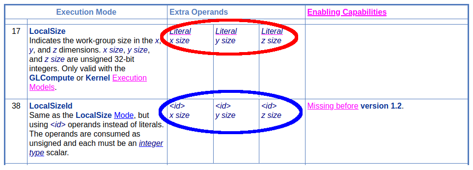

# Entry Point, Execution Model, and Execution Mode

The start of every SPIR-V module will contain the `OpEntryPoint` and `OpExecutionMode`/`OpExecutionModeId` instructions. This chapter is to take a more indepth look into them and edge cases tool developrs will need to watch out for.

> Note: It is very easy to mix up the term `model` and `mode` if not reading carefully

# Multiple Entry Points

A SPIR-V module can have more than one Entry Point. This allows the possibility of sharing SPIR-V what otherwise would have to be a second SPIR-V module and possible code duplication.

Each `OpEntryPoint` has the `Execution Model` and `Name` value with an important phrase in the spec

> A module must not have two OpEntryPoint instructions with the same Execution Model and the same Name string.

This means the following is legal SPIR-V:

```swift
OpEntryPoint GLCompute %main "name_a"
OpEntryPoint GLCompute %main "name_b"
```

or

```swift
OpEntryPoint Vertex %main "name" %interface
OpEntryPoint CallableKHR %main "name"
```

But the following will fail:

```swift
OpEntryPoint GLCompute %main_a "name_c"
OpEntryPoint GLCompute %main_b "name_c"

// error: 2 Entry points cannot share the same name and ExecutionMode.
```

This means any tool will have to be mindful that an **entry point is not unique to single value**. Tool consuming SPIR-V must be aware that two entry points can share the same `Execution Model` or `Name` operand of multiple `OpEntryPoint`.

# Execution Mode

The `OpExecutionMode` and `OpExecutionModeId` are simple as they point to an `Entry Point` ID and set the `Execution Mode` for it. The important information is to understand the difference between the two instructions.

> A notable difference in the spec is that `OpExecutionModeId` was added in SPIR-V 1.2

> Also worth noting that as of now, there are no possible uses of `OpExecutionModeId` for Shader capability-based client APIs such as Vulkan

The only difference between the two instructions is how it handles possible `Extra Operands`.

`OpExecutionMode` uses `Literal`

```swift
OpExecutionMode %main LocalSize 1 1 1
```

while `OpExecutionModeId` uses `<id>`

```swift
OpExecutionModeId %main LocalSizeId %x %y %z
```

This is noted in the [Execution Mode part of the spec](https://www.khronos.org/registry/spir-v/specs/unified1/SPIRV.html#Execution_Mode)



# Instructions with multiple execution modes

It is not obvious at first glance, but instructions in a function block can be ran with multiple execution modes. Imagine the following pseudo code:

```glsl
float foo(float bar) {
    return bar / 2.0;
}

void vertex_main() {
    // set RoundingModeRTE
    foo(3.0);
}

void fragment_main() {
    // set RoundingModeRTZ
    foo(3.0);
}
```

which gets tranlated to roughly the following in SPIR-V

```swift
       OpEntryPoint Vertex %v_main "vertex_main" %vert_out
       OpEntryPoint Fragment %f_main "fragment_main"
       OpExecutionMode %vertex_main RoundingModeRTE 32
       OpExecutionMode %fragment_main RoundingModeRTZ 32
       // ...
%foo = OpFunction %float None %1
%bar = OpFunctionParameter %ptr_float
  %2 = OpLabel
  %3 = OpLoad %float %bar
  %4 = OpFDiv %float %3 %float_2
       OpReturnValue %4
       OpFunctionEnd
```

In this example, depending on the entrypoint taken, `OpFDiv` will either use `RoundingModeRTE` or `RoundingModeRTZ` rounding.