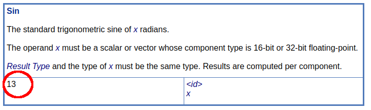

# Extended Instruction Sets

[Extended instruction sets](https://registry.khronos.org/SPIR-V/specs/unified1/SPIRV.html#_a_id_extinst_a_extended_instruction_sets) allow SPIR-V to at a core to be agnostic as many high-level shading languages describe rules around the same instructions differently.

> Example: The accuracy for an instruction such as `sin()` might be different in GLSL shaders than it is in OpenCL kernels

## Separate Spec

All extended instruction sets are specified in independent specifications as [listed in the registry](https://registry.khronos.org/SPIR-V/#extins).

There are three things needed when referring to an extended instruction set

1. Reference the [extended instruction set spec](https://registry.khronos.org/SPIR-V/specs/unified1/)
2. Use the header in [SPIRV-Headers](https://github.com/KhronosGroup/SPIRV-Headers/tree/main/include/spirv/unified1)
    - Example: `GLSL.std.450.h`
3. Be aware the header was generated from the grammar JSON file in [SPIRV-Headers](https://github.com/KhronosGroup/SPIRV-Headers/tree/main/include/spirv/unified1)
    - Example: `extinst.glsl.std.450.grammar.json`

## Example using extended instruction sets

Looking at a simple GLSL shader which uses `sin()`

```glsl
#version 450

layout(location = 0) in float inputValue;

void main() {
    float pos = sin(inputValue);
    gl_Position = vec4(pos, 1.0, 1.0, 1.0);
}
```

produces the following SPIR-V disassembly

```swift
    %1 = OpExtInstImport "GLSL.std.450"

%float = OpTypeFloat 32
  %ptr = OpTypePointer Input %float
  %var = OpVariable %_ptr_Input_float Input

  %pos = OpVariable %_ptr_Function_float Function
   %11 = OpLoad %float %var
   %12 = OpExtInst %float %1 Sin %11
         OpStore %pos %12
   %22 = OpLoad %float %pos
```

Breaking this down:

- Need to import the name of the extended instruction set being added with `OpExtInstImport`
- Use `OpExtInst`
    - Set the `Set` field to the imported non-semantic extension
    - Set the `Instruction` to the non-semantic extension specific instruction being added
        - For `GLSL.std.450` it is listed as being instruction `13` in the [extended instruction set spec](https://registry.khronos.org/SPIR-V/specs/unified1/GLSL.std.450.html)
        - 