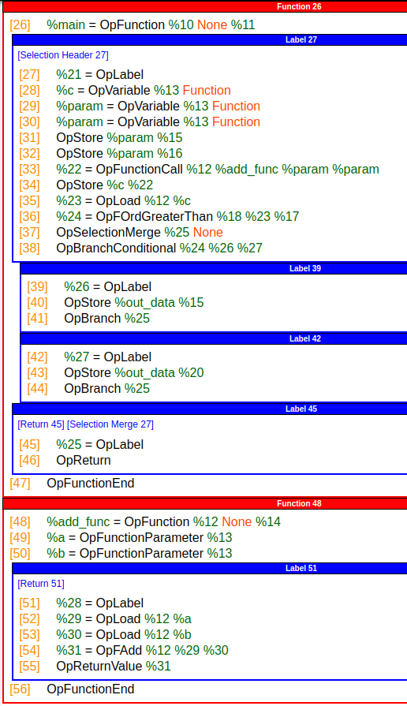

# Functions and Blocks

Similar to LLVM, SPIR-V is made of up of `Blocks`. The `Blocks` can together form a `Function`.

Using the following GLSL example to help explain the concept:

```glsl
float add(float a, float b) {
    return a + b;
}

void main() {
    float c = add(in_a, in_b);

    if (c > 0.0) {
        out_data = 1.0;
    } else {
        out_data = -1.0;
    }
}
```

will produce the following SPIR-V disassembly



## Function Block

Every function is starts with `OpFunction` and ends with the `OpFunctionEnd` instruction.

The `OpFunctionCall` can be used to jump to another function.

## Blocks

A function may contain many `Blocks`. Every block first starts with a `OpLabel` and ends with a [Block Termination Instruction](https://registry.khronos.org/SPIR-V/specs/unified1/SPIRV.html#Termination).
