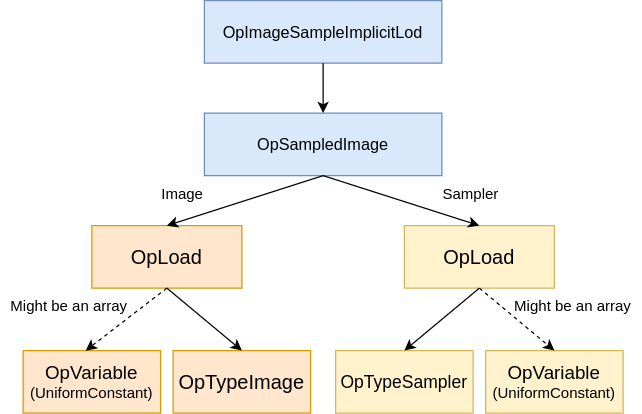
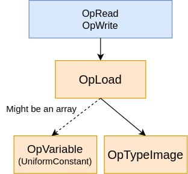

# Image Accesses

SPIR-V has various [Image Instructions](https://registry.khronos.org/SPIR-V/specs/unified1/SPIRV.html#_image_instructions) that interact with `OpTypeImage`. This chapter aims to give some extra context around these instructions.

> There is an [example.frag](./examples/image_accesses/example.frag) (and [example.spv](./examples/image_accesses/example.spv)) GLSL shader that has an example of various ways images can be accessed in SPIR-V.

# Images as Handles

An `OpTypeImage` can be thought of as a handle to the underlying texel data. To help illustrate this, here is a small program that writes to an image

```glsl
layout(set = 0, binding = 1, rgba8) uniform writeonly image2D image;
void main() {
    imageStore(image, ivec2(0, 0), vec4(1.0));
}
```

Taking a closer look at the `OpVariable` we see it is of type [UniformConstant](../chapters/storage_class.md#uniformconstant) which is suppose to be "read-only" (yet there is a clear `OpImageWrite` occuring here).

This is possible because the handle to the image is read-only, but the underlying texel data of the image is mutable.

A software mental model of the `OpTypeImage` is to think of it as container that holds metadata while also holding the data of the image.

```c++
struct ImageType {
  bool depth;
  bool arrayed;
  bool sampled;
  bool multisampled;
  Format format;
  int width;
  // other metadata ...
  void* texels; // data of the image (which is mutable)
}
```

The above `OpVariable` is read-only because we are not allowed to adjust its format, width, or multisampling state ever.

# Sampled Images

When using a sampler, you must have an `OpTypeSampledImage` object, this will be directly pointing to an `OpTypeImage` object.

To access the sampled image you will use an `OpImage*Sample*` instruction (ex. `OpImageSampleImplicitLod`) to get an `OpSampledImage`. (It can also use an `OpImage*Gather` as well)



## Fetch

There are also `OpImageFetch` (and `OpImageSparseFetch`) instructions which work similar as `OpImage*Sample*`.

While the `OpImage*Sample*` takes float coordinates and does a lookup to get the texel, the `OpImageFetch` takes direct image coordinates to the exact texel to return.

This means an `OpImageFetch` will directly access through an `OpImage` and doesn't need an `OpSampledImage` object.

# Non-sampled image

When not using a sampler (ex. storage image), you can directly use an `OpTypeImage` object.

> Note you will **not** be using an `OpImage` when accessing an image without a sampler. The `OpImage` is designed to point to the image of the sampler/image combination.

The `OpImageRead` and `OpImageWrite` will directly go to the `OpLoad` into the variable.



> The `OpImageWrite` calls `OpLoad` but this is **not** an image "read access". The `OpLoad` just grabs the reference, but there is only a "write access" here on the image.

# Image Queries

There are some `OpImageQuery*` instructions that are designed to directly access an `OpTypeImage` object. The image itself is not accessed.

## OpImageTexelPointer

Before you do an operation such as an atomic image load, you need to get a pointer for the memory.

The `OpImageTexelPointer` allows you to take a texel inside an image, and create a pointer to it which can be accessed by an atomic image operation.

Example: `OpAtomicLoad -> OpImageTexelPointer -> OpVariable`

To see this in practice we can view the difference between a `imageAtomicStore` and `imageStore` call

```swift
%1 = OpImageTexelPointer %OpTypePointer %atomic_image %coor %sample
     OpAtomicStore %1 %_ %_ %scalar_value

%2 = OpLoad %OpTypeImage %image
     OpImageWrite %2 %coor %texel
```

While the `OpLoad` returns an `OpTypeImage` that we store the new texel, with `OpImageTexelPointer` we get a direct pointer to the texel data and can store scalar value like `OpConstant %int 0`. This is posssible because the `Coordinate` operand is supplied in the `OpImageTexelPointer` instead afterwards in the actual "write" operation.

## OpImageSparseTexelsResident

When dealing with sparse textures, you can have some memory that is not actually available to access. Before trying to access it, we will want to query to make sure it is safe.

By calling `OpImageSparseTexelsResident` it will return a `true`/`false` to let you know if the access is available.

The important part for those consuming SPIR-V is while this instruction name starts with `OpImage*`, it does **not** actually access the image at all.
