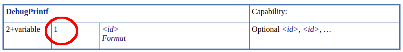

# Non-Semantic Instructions

> Non-Semantic can be looked at as just a special case of an [extended instruction set](./extended_instruction_sets.md)

The addition of the [SPV_KHR_non_semantic_info](http://htmlpreview.github.io/?https://github.com/KhronosGroup/SPIRV-Registry/blob/main/extensions/KHR/SPV_KHR_non_semantic_info.html) extension adds the ability to declare extended instruction sets that have no semantic impact and can be safely removed from a module. This uses the [OpExtInstImport](https://registry.khronos.org/SPIR-V/specs/unified1/SPIRV.html#OpExtInstImport) and [OpExtInst](https://registry.khronos.org/SPIR-V/specs/unified1/SPIRV.html#OpExtInst) instructions.

This was added so tools such as the Vulkan Validation Layers, RenderDoc, etc could inject SPIR-V instructions to aid in tooling without worrying about the implementation compiler crashing from an unknown instruction.

## Using non-semantic

> The following will be using the [Debug Printf](https://vulkan.lunarg.com/doc/sdk/latest/windows/debug_printf.html) non-semantic [instruction](http://htmlpreview.github.io/?https://github.com/KhronosGroup/SPIRV-Registry/blob/main/nonsemantic/NonSemantic.DebugPrintf.html) as an example.

Taking a GLSL shader of

```glsl
#version 450
#extension GL_EXT_debug_printf : enable

void main() {
    float myfloat = 2.0;
    debugPrintfEXT("Here are two float values %f, %f", 1.0, myfloat);
}
```

the output SPIR-V disassembly roughly looks like

```swift
       OpExtension "SPV_KHR_non_semantic_info"
%13  = OpExtInstImport "NonSemantic.DebugPrintf"

%2   = OpTypeVoid
%10  = OpString "Here are two float values %f, %f"
       OpSourceExtension "GL_EXT_debug_printf"

%14  = %2 OpExtInst %13 %1 %10 %11 %12
```

Breaking this down:

- First need to make sure the `SPV_KHR_non_semantic_info` is enabled
- Need to import the name of the non-semantic extension being added with `OpExtInstImport`
- Use `OpExtInst`
    - Set the `Set` field to the imported non-semantic extension
    - Set the `Instruction` to the non-semantic extension specific instruction being added
        - For `DebugPrintf` it is listed as being instruction `1` in the [NonSemantic.DebugPrintf extension spec](http://htmlpreview.github.io/?https://github.com/KhronosGroup/SPIRV-Registry/blob/main/nonsemantic/NonSemantic.DebugPrintf.html)
        - 

### Revisions

Some non-semantic extensions have multiple revisions. Some extensions will append the version on the end of the string, for example:

```swift
OpExtInstImport  "NonSemantic.ClspvReflection.1"  // revision 1
OpExtInstImport  "NonSemantic.ClspvReflection.2"  // revision 2
```

The details of versioning and the string to detect can be found per extension in the [SPIRV-Registry](https://github.com/KhronosGroup/SPIRV-Registry/tree/main/nonsemantic)

## No literals allowed

For those parsing the grammar, you may notice for non-semantic instruction there are no references to `ValueEnum` or `BitEnum`. So instead of having something such as

```json
{ "kind" : "SomeEnumName", "name" : "'Value'" },
```

everything will be an `IdRef` that points to an `OpConstant` or `OpString` instead

```json
{ "kind" : "IdRef", "name" : "'Value'" },
```

More information can be found in [OpExtInstImport](https://registry.khronos.org/SPIR-V/specs/unified1/SPIRV.html#OpExtInstImport), but this is done so if someone introduced a new non-semantic instruction, things will not break from under an old parser.

## Adding a new non-semantic extension

> Set of instructions to get a non-semantic extension added

- Add to the [SPIRV-Registry](https://github.com/KhronosGroup/SPIRV-Registry/tree/main/nonsemantic) repo
    - [Example PR](https://github.com/KhronosGroup/SPIRV-Registry/pull/61/files)
- Add to the [SPIRV-Headers](https://github.com/KhronosGroup/SPIRV-Headers) repo
    - Add a grammar file at `include/spirv/unified1/extinst.nonsemantic.<INSERT_NAME>.grammar.json`
    - Add line to bottom of the [generator script](https://github.com/KhronosGroup/SPIRV-Headers/blob/main/tools/buildHeaders/bin/makeExtinstHeaders.py)
        - `mk_extinst('NonSemantic<INSERT_NAME>', 'extinst.nonsemantic.<INSERT_NAME>.grammar.json')`
    - Run script ([as described in the README](https://github.com/KhronosGroup/SPIRV-Headers#generating-c-headers-for-extended-instruction-sets)) to generate the C header file.
    - [Example PR](https://github.com/KhronosGroup/SPIRV-Headers/pull/145/files)
