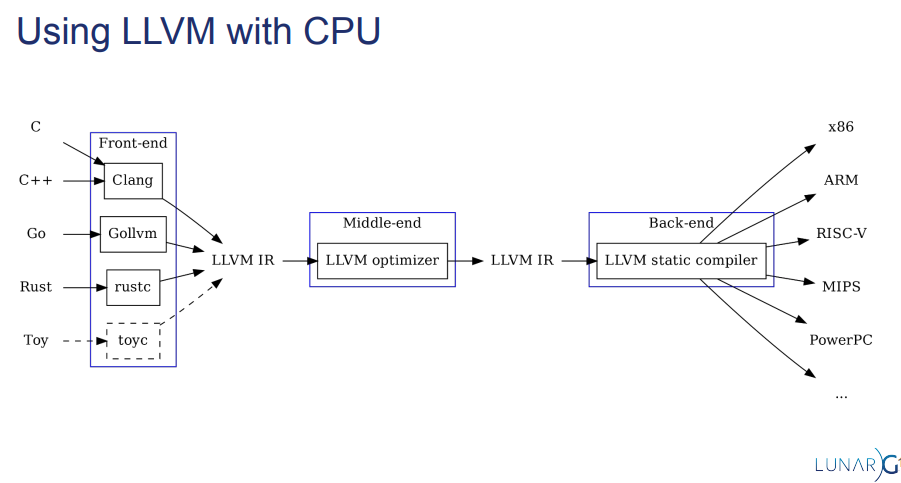
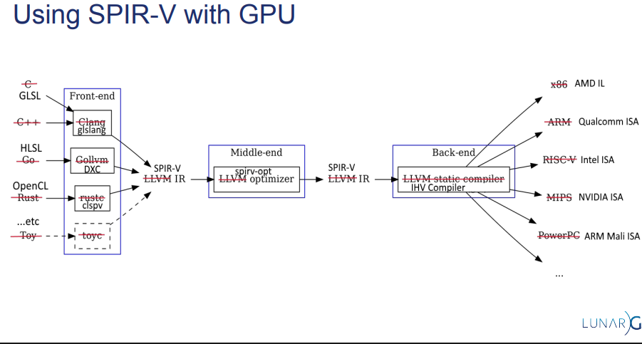

# What is SPIR-V

[SPIR-V](https://registry.khronos.org/SPIR-V/) is a binary [intermediate representation](https://en.wikipedia.org/wiki/Intermediate_representation) interchange format used to interface with a heterogeneous machine. SPIR-V expresses the operations that can be broken down to match an [ISA](https://en.wikipedia.org/wiki/Instruction_set_architecture) found on a GPU, FPGA, DSP, CPU, etc. The most common use cases of SPIR-V is to be used
for graphical-shader stages and compute kernels in other APIs such as Vulkan, OpenGL and OpenCL.

The [Khronos SPIR-V Registry](https://registry.khronos.org/SPIR-V/) is the home for:

* The SPIR-V specification,
* Specifications for supported extended instruction sets, and
* Specifications for Khronos and vendor extensions to SPIR-V.

LunarG has written a very nice [white paper](https://registry.khronos.org/SPIR-V/papers/WhitePaper.pdf) about SPIR-V and its advantages, and a high-level description of the binary representation. There are also two great Khronos presentations from Vulkan DevDay 2016 [here](https://www.khronos.org/assets/uploads/developers/library/2016-vulkan-devday-uk/3-Intro-to-spir-v-shaders.pdf) and [here](https://www.khronos.org/assets/uploads/developers/library/2016-vulkan-devday-uk/4-Using-spir-v-with-spirv-cross.pdf)
([video of both](https://www.youtube.com/watch?v=XRpVwdduzgU)).

Compiler technology and languages evolve quickly.  SPIR-V provides a common interchange format to transition, not just into Vulkan, OpenGL, and OpenCL drivers, but between different tool chains.  With a well defined format, validation rules, and rich tools SPIR-V enables custom shader compiler flows, choice of language, and debuggability not available with graphical shaders and compute kernels before.

## SPIR-V for people coming from CPU land

Likely people are used to the idea of how LLVM is used as a IR for the CPU world to get any front end langage to various ISA

We can take that same idea and replace `LLVM IR` here with `SPIR-V`

> SPIR-V design has many aspects taken from how LLVM IR is structured

